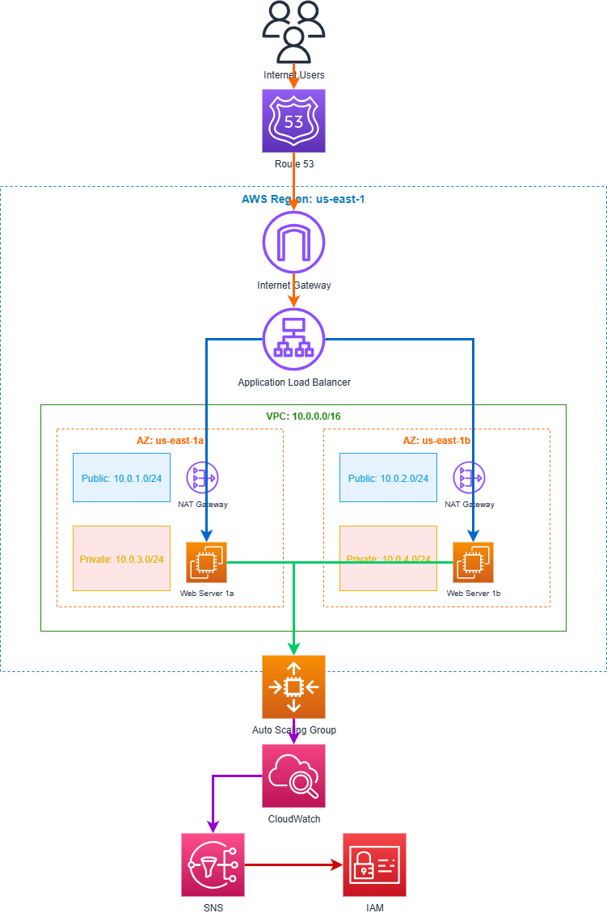

# AWS Scalable Web Application Project

## Project Overview

This project show the deployment of a scalable web application on AWS using EC2 instances, ensuring high availability and scalability using (ALB) and Auto Scaling Groups. The architecture consider best practices for compute scalability, security, and cost optimization.

## Architecture Diagram




## Architecture Components

### Core Infrastructure

**Virtual Private Cloud (VPC)**
- CIDR Block: 10.0.0.0/16
- Region: us-east-1
- Multi-AZ deployment for high availability

**Subnets Configuration**
- Public Subnets:
  - us-east-1a: 10.0.1.0/24
  - us-east-1b: 10.0.2.0/24
- Private Subnets:
  - us-east-1a: 10.0.3.0/24
  - us-east-1b: 10.0.4.0/24

**Networking Components**
- Internet Gateway: Provides internet access to public subnets
- NAT Gateways: Enable outbound internet connectivity for private subnets (one per AZ)
- Route 53: DNS service

### Compute and Load Balancing

**EC2 Instances**
- Instance Type: t3.micro (Free Tier)
- Operating System: Amazon Linux 2
- Placement: Distributed across multiple Availability Zones
- Security Groups: Configured for web traffic (HTTP/HTTPS)

**Application Load Balancer (ALB)**
- Type: Application Load Balancer
- Scheme: Internet-facing
- Target Groups: EC2 instances in private subnets
- Health Checks: Configured for application health monitoring

**Auto Scaling Group (ASG)**
- Min Size: 2 instances
- Max Size: 6 instances
- Desired Capacity: 2 instances
- Scaling Policies: CPU-based scaling triggers

### Security and Access Management

**IAM (Identity and Access Management)**
- EC2 Instance Roles: Secure access to AWS services
- Policies: Least privilege access principles
- Service Roles: For Auto Scaling and CloudWatch integration

### Monitoring and Alerting

**CloudWatch**
- Metrics: CPU utilization, network traffic, custom application metrics
- Alarms: Automated scaling triggers and health monitoring
- Logs: Application and system log aggregation

**SNS (Simple Notification Service)**
- Topics: Alert notifications for scaling events and system issues
- Subscriptions: Email/SMS notifications for administrators

## Key AWS Services Used

| Service | Purpose | Configuration |
|---------|---------|---------------|
| EC2 | Web application hosting | Multiple instances across AZs |
| ALB | Load balancing and traffic distribution | Internet-facing with health checks |
| ASG | Automatic scaling based on demand | Min: 2, Max: 6 instances |
| VPC | Network isolation and security | 10.0.0.0/16 with public/private subnets |
| IAM | Security and access control | Role-based access for instances |
| CloudWatch | Monitoring and metrics | CPU, network, and custom metrics |
| SNS | Notification service | Alerts for scaling and health events |
| Route 53 | DNS resolution | DNS |
| Internet Gateway | Internet connectivity | Public subnet internet access |
| NAT Gateway | Outbound internet for private subnets | One per AZ for redundancy |

## Deployment Instructions

### Prerequisites

Before deploying this infrastructure, ensure you have:

- AWS CLI installed and configured with your credentials
- Sufficient IAM permissions to create VPC, EC2, ELB, Auto Scaling, and IAM resources

### Quick Start Deployment

This project includes automated deployment scripts that will set up the entire infrastructure:

#### Step 1: Deploy Infrastructure
```bash
./deploy-infrastructure.sh
```

This script will create:
- VPC with public and private subnets across two AZs
- Internet Gateway and NAT Gateways
- Route tables and security groups
- All necessary networking components

#### Step 2: Deploy Application Components
```bash
./deploy-application.sh
```

This script will create:
- Application Load Balancer with target groups
- Launch template for EC2 instances
- Auto Scaling Group with scaling policies
- IAM roles and instance profiles

#### Step 3: Set Up Monitoring
```bash
./setup-monitoring.sh
```

This script will create:
- CloudWatch alarms for CPU, response time, and target health
- SNS topic for notifications
- CloudWatch dashboard for monitoring

#### Step 4: Subscribe to Alerts
```bash
aws sns subscribe --topic-arn "SNS_TOPIC_ARN" --protocol email --notification-endpoint m3ouf@hotmail.com --region us-east-1
```

### Verification

After deployment, verify the setup:

1. **Check Application Availability**: Access your application using the ALB DNS name provided in the deployment output
2. **Monitor Scaling**: Generate load to test auto scaling functionality
3. **Verify High Availability**: Terminate an instance to ensure the application remains available

### Manual Deployment Steps

If you prefer to understand each component, here are the manual steps:

1. **Create VPC and Networking**
   - Create VPC with CIDR 10.0.0.0/16
   - Create public and private subnets in multiple AZs
   - Set up Internet Gateway and NAT Gateways
   - Configure route tables

2. **Configure Security**
   - Create security groups for ALB and web servers
   - Set up IAM roles for EC2 instances
   - Configure security group rules

3. **Deploy Load Balancer**
   - Create Application Load Balancer
   - Set up target groups with health checks
   - Configure listeners

4. **Set Up Auto Scaling**
   - Create launch template with user data
   - Configure Auto Scaling Group
   - Set up scaling policies

5. **Configure Monitoring**
   - Create CloudWatch alarms
   - Set up SNS notifications
   - Create monitoring dashboard

## Security

**Network Security**
- Web servers deployed in private subnets
- Security groups configured with minimal required ports
- Network ACLs provide additional network layer security

**Access Control**
- IAM roles used instead of access keys for enhanced security
- Least privilege principle applied to all permissions
- Regular credential rotation implemented

**Data Protection**
- EBS encryption enabled for all volumes
- SSL/TLS certificates configured for HTTPS communication
- Regular security updates applied to all instances

## Cost Optimization Strategies

**Instance Management**
- Appropriate instance types selected (t3.micro for development environments)
- Scheduled scaling implemented for predictable workloads
- Reserved instances utilized for baseline capacity requirements

**Resource Optimization**
- CloudWatch metrics monitored to identify unused resources
- Auto Scaling policies configured to match actual demand
- Regular cost analysis performed to identify optimization opportunities


## Testing and Validation

**Load Testing**

```bash
sudo yum install httpd-tools
ab -n 1000 -c 10 http://your-alb-dns-name/
```

**Auto Scaling Validation**
Monitor CloudWatch metrics during load tests to verify that instances scale up and down based on CPU utilization thresholds. Check that the Application Load Balancer health checks are functioning correctly.

**High Availability Testing**
Test the system's resilience by terminating instances in one Availability Zone and verifying that the application remains available. Monitor how traffic is redistributed across healthy instances.

## Cleanup

To avoid ongoing charges, clean up resources when done:

```bash
aws autoscaling delete-auto-scaling-group --auto-scaling-group-name scalable-web-app-asg --force-delete --region us-east-1

aws elbv2 delete-load-balancer --load-balancer-arn <ALB_ARN> --region us-east-1

```

## Project Files

```
├── README.md                        # This documentation
├── deploy-infrastructure.sh         # Infrastructure deployment script
├── deploy-application.sh            # Application deployment script
├── setup-monitoring.sh              # Monitoring configuration script
└── config.env                       # Generated configuration file
```
